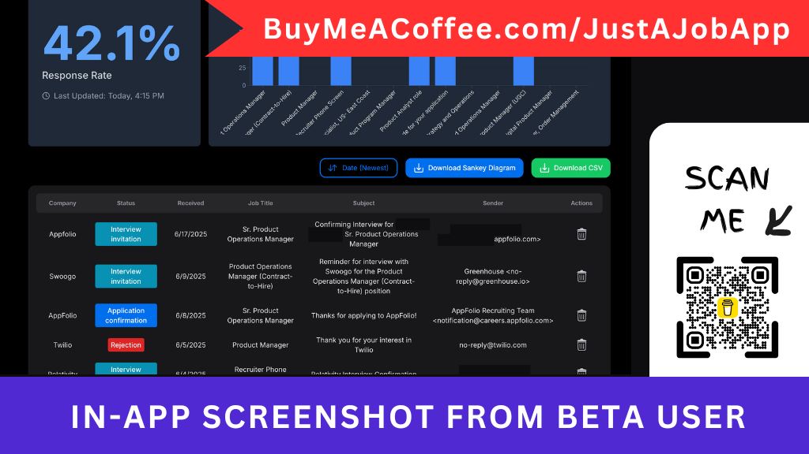
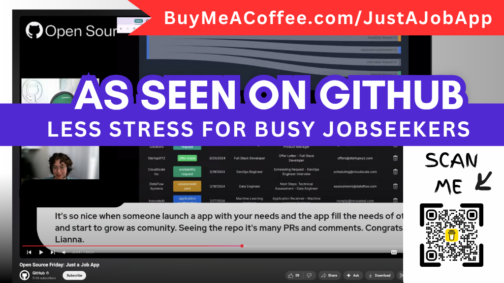

# Stop dreading your job search.

## JustAJobApp.com connects to your inbox to automatically build your job search dashboard. No more spreadsheets. No more manual data entry.

The job search is officially broken, and it's not just you. Applications per hire have tripled since early 2021, leaving even qualified candidates stuck in an endless cycle of submitting resumes into the void.

## Get Started

Choose your DIY Install path: 
- Like watching? [Video 📹](https://github.com/just-a-job-app/jobseeker-analytics?tab=contributing-ov-file#-video-tutorial-diy-install) 
- More of a reader? [Manual 📖](https://github.com/just-a-job-app/jobseeker-analytics?tab=contributing-ov-file#-written-tutorial-diy-install)

No GitHub account? [Reserve 50% off when we launch](https://buymeacoffee.com/justajobapp).

## Problem: The Job Search is Burning You Out

The market is brutal. Applications per hire have tripled since 2021, and 90% of candidates are rejected or ghosted.

No wonder 64% of job seekers report symptoms of burnout—feeling exhausted, stuck, and overwhelmed.

If you're already managing a full-time job, the last thing you have time for is:
- Manually copying and pasting job descriptions into a spreadsheet.
- Sifting through your inbox to find out who you heard back from.
- Worrying you're missing critical recruiter emails in your spam folder.
- Losing track of applications, deadlines, and follow-ups.

Your problem isn't your qualifications; it's the inefficient, time-consuming process.

## Our Solution: Stop "Clipping." Start Automating.

Unlike other job trackers (Huntr, Teal, Simplify) that force you to manually "clip" every job with a browser extension, JustAJobApp.com is automated.

Apply for a job. Get a confirmation email. That's it. Your tracker is now up to date. It’s an email-powered tracker designed for busy professionals who value efficiency and discretion.

## Why 100+ Beta Testers Ditched Their Spreadsheets

Computer Science & Engineering New Grad (May 2025), F1-OPT:
> "I receive so many emails a day that I mistook one for a rejection. Later, I saw a color-coded 'Hiring Freeze' status in JustAJobApp that caught my eye. It prompted me to go back and find the email—it wasn't a rejection, but an invitation to apply for a reopened position. I would have completely missed this opportunity if it wasn't for JustAJobApp."

Donal Murphy, MBA, Global Events Producer:
> "I get to see the entire picture on a single dashboard... and not have to continually update a spreadsheet."

## Coming Soon

Tracking your applications is just the beginning. 

The next, most stressful step is preparing for the interview.

Once the system detects an interview in your inbox, it will automatically spring into action. 

We're building a system to help you prepare by identifying interviewers from the calendar invite, drafting company-specific questions, and mapping key talking points from your resume to the job description.

## The Current Roadblock

We are currently blocked by Google's 100-user hard cap. To lift this cap and make the app available to everyone, I must pass a one-time, $3,000 mandatory security audit.

Today I had to turn away another job seeker who needed this tool but was (rightfully) concerned about its unverified status.

Your [support](https://buymeacoffee.com/justajobapp) will directly fund this audit. It is the only thing standing between us and helping thousands of job seekers.

## News 

In July 2025, we secured a feature on GitHub's official YouTube channel, which has over 500,000 subscribers.

🎥 [Watch the full episode here](https://youtu.be/sbzKMVaYHZw?list=PL0ZEIUccq0tD_c7gV0lAMXDXl-xK4pxch&t=1260) 

## Get Involved

- Over 25 volunteer developers and 100 beta testers helped build what JustAJobApp.com is today. We've tracked over 3,000 applications and 268 interview invites.
- But we are currently blocked. Google has a 100-user hard cap on unverified apps. To lift this cap and make a less stressful job search experience available to everyone (outside the developer community), we must pass a one-time, $3,000 mandatory security audit.
- Recently I had to turn away another job seeker who needed this tool but was (rightfully) concerned about its unverified status.
- So I've set up a BuyMeACoffee page to [raise the $3,000 to pass the security audit](https://www.buymeacoffee.com/justajobapp). It's the only thing standing between us and helping thousands of job seekers.

Check out the page below to support us.

## Thank You to Our Contributors

