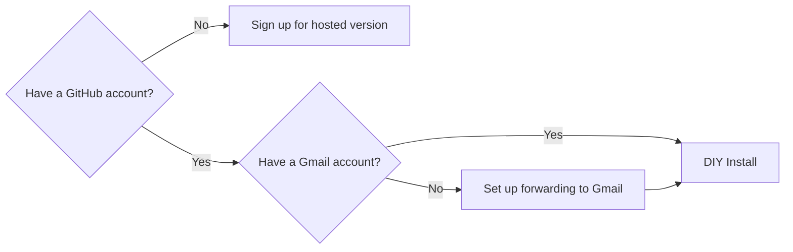

# JustAJobApp

**An automated job application tracker that connects to your Gmail inbox.** Apply for jobs, receive confirmation emails, and your dashboard updates automatically. No browser extensions. No manual data entry. No spreadsheets.

---

## A Single Lost Email Cost Me $40,000

After being laid off by email in 2024, I managed 46 interview pipelines from 129 applications. During a 9-interview week, a manual tracking error led to a missed interview—for a role paying $40,000 more than the offers I received.

I built JustAJobApp so this never happens to you.

---

## The Job Search Crisis

**2–3× More Applications:** Pre-pandemic research found job seekers sent ~12 applications per month. JustAJobApp users send 7–12 per *week*—over 2× the historical volume. That's 2× more confirmation emails, rejections, and interview threads flooding your inbox.

**7,800+ Applications Tracked:** That's 7,800+ confirmation emails, status updates, and interview requests our users no longer manage manually.

**Spreadsheets Aren't Helping:** 72% of surveyed job seekers use 3+ different apps to track their search. Moving data between emails, calendars, and spreadsheets manually is where the $40,000 mistakes happen.

---

## How It Works

1. **Connect your Gmail** — Secure sign-in, takes 30 seconds
2. **Apply for jobs like normal** — No browser extensions, no clipping
3. **Your dashboard updates automatically** — Confirmation emails become tracked applications

Unlike other job trackers that force you to manually "clip" every job with a browser extension, JustAJobApp is fully automated.

---

## Privacy Is Our Product

For a tool that reads your inbox, trust is everything. We're committed to radical transparency.

### We Don't Read Your Emails

We use a narrow search query for job-related messages only. If an email isn't from a known hiring platform or doesn't contain keywords like "application received," we ignore it entirely. Our filter list is public: see [`applied_email_filter.yaml`](applied_email_filter.yaml).

### Your Data Is Not for Sale

We use Google's paid Gemini API, which contractually forbids them from using your data to train their models. Your data is yours, and it is never monetized.

### What We Store

Only the metadata necessary to build your dashboard:
- Sender name and email
- Application status (e.g., "Interview," "Rejection")
- Timestamp, company name, job title

If our system determines an email is a false positive (not job-related), we don't store anything about it.

### Why Open Source?

Because we handle sensitive data, we believe our code should be open for public audit. More eyeballs means higher security standards.

---

## What People Are Saying

> *"I receive so many emails a day that I mistook one for a rejection. Later, I saw a color-coded 'Hiring Freeze' status in JustAJobApp that caught my eye. It prompted me to go back and find the email—it wasn't a rejection, but an invitation to apply for a reopened position. I would have completely missed this opportunity."*
> — **CS & Engineering New Grad, F1-OPT**

> *"I get to see the entire picture on a single dashboard... and not have to continually update a spreadsheet."*
> — **Donal Murphy, MBA, Global Events Producer**

---

## Getting Started

### Hosted Version (Limited Availability)

**[JustAJobApp.com](https://justajobapp.com?utm_source=github&utm_campaign=readme)** — Free to use. Connect your Gmail and start tracking in under 2 minutes.

> ⚠️ **Only ~15 spots remaining.** We're capped at 100 users until our security audit is complete (estimated 1–2 months). [Join the waitlist](https://its.justajobapp.com/?utm_source=github&utm_campaign=readme) to be notified when we open up.

### DIY Install (Developers)

If you have a GitHub account, you can run JustAJobApp for free on your own infrastructure—no waitlist, no user cap.

**Choose your path:**
- 📹 **[Video tutorial](https://github.com/just-a-job-app/jobseeker-analytics?tab=readme-ov-file#-video-tutorial-diy-install)** — Watch the walkthrough
- 📖 **[Written guide](https://github.com/just-a-job-app/jobseeker-analytics?tab=readme-ov-file#-written-tutorial-diy-install)** — Step-by-step instructions

> **Don't have Gmail?** You can set up email forwarding from your primary inbox to a Gmail account, then connect that to JustAJobApp.

---

## Coming Soon: Paid Plans with Interview Prep

The core tracker is free for jobseekers as long as we can cover operating costs. Paid plans will unlock advanced features like Instant Interview Prep.

Customer discovery with 32 job seekers confirmed that **56% could not locate job descriptions or notes immediately before an interview.**

When JustAJobApp detects an interview on your calendar, it will:
- Identify your interviewers from the calendar invite
- Draft company-specific questions
- Map key talking points from your resume to the job description
- Optionally notify your career coach to help you prepare

### 📬 [Join the waitlist →](https://its.justajobapp.com/?utm_source=github&utm_campaign=readme_paid)

Get notified when spots open up and when Interview Prep launches.

---

## For Career Coaches (Pilot Program)

We're running a pilot with career coaches who want real-time visibility into their clients' job searches.

Get access to:
- Upcoming interviews
- Referrals and recruiter inbounds
- Job offers

👉 **[Coach.JustAJobApp.com](https://coach.justajobapp.com?utm_source=github&utm_campaign=readme)** — Apply to join the pilot

---

## As Seen On

🎬 **Featured twice on GitHub's official YouTube channel (586K subscribers)**

- **July 2025:** First feature on GitHub's YouTube
- **December 2025:** Named one of ["GitHub's Favorite Open Source Projects of 2025"](https://www.youtube.com/watch?v=1ckVnvo-qcw&t=9s)

---

## Contributing

JustAJobApp is built by jobseekers, for jobseekers. Our contributors are often going through the job search themselves.

### New to Open Source? Start Here.

**[Mini-Quest: Join the Wall of Fame](https://github.com/JustAJobApp/jobseeker-analytics/blob/main/CONTRIBUTOR_ONBOARDING.md)** — A guided tutorial that takes you from zero to your first pull request.

By the end, you will:

✅ Have JustAJobApp tracking your job search
✅ Add Git, GitHub, and Docker to your resume
✅ Get featured on our [Contributors Wall](https://justajobapp.com/contributors)

No prior open source experience required.

### Already Comfortable with Git?

- 📹 **[Video tutorial](https://github.com/JustAJobApp/jobseeker-analytics?tab=readme-ov-file#-video-tutorial-diy-install)** — Watch the walkthrough
- 📖 **[Written guide](https://github.com/JustAJobApp/jobseeker-analytics?tab=readme-ov-file#-written-tutorial-diy-install)** — Step-by-step instructions
- 🐛 **[Open issues](https://github.com/JustAJobApp/jobseeker-analytics/issues?q=is%3Aissue%20state%3Aopen%20label%3A%22help%20wanted%22%20no%3Aassignee)**

**Support the project:** If JustAJobApp has helped your job search, consider [supporting us](https://donate.stripe.com/fZu28r8Q98jSeGD8lFdIA00).

---

## FAQ

<strong>Are you going to read all my emails?</strong>

No. JustAJobApp doesn't "crawl" your entire inbox. We use a specific search query to identify only potential job-related threads before the application even looks at the content. Our filter list is public in [`applied_email_filter.yaml`](applied_email_filter.yaml).

<strong>I use my personal email for everything. Is that okay?</strong>

Yes. We only access emails matching our pre-defined filters—specific sender domains (like greenhouse.io) and keywords (like "application received"). Everything else is ignored entirely.

<strong>Do I have to use the web app?</strong>

No. If you're technical, you can self-host by following the instructions above.

<strong>Why is this open source?</strong>

Transparency. Because we handle sensitive data, we believe our code should be open for public audit. Having "more eyeballs" ensures higher security standards.

---

## License

[MIT License](LICENSE)

Built with ❤️ by a jobseeker who lost $40,000 to a missed email—so you don't have to.
