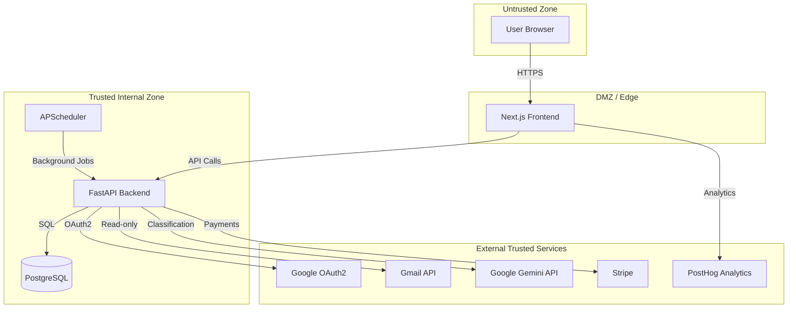
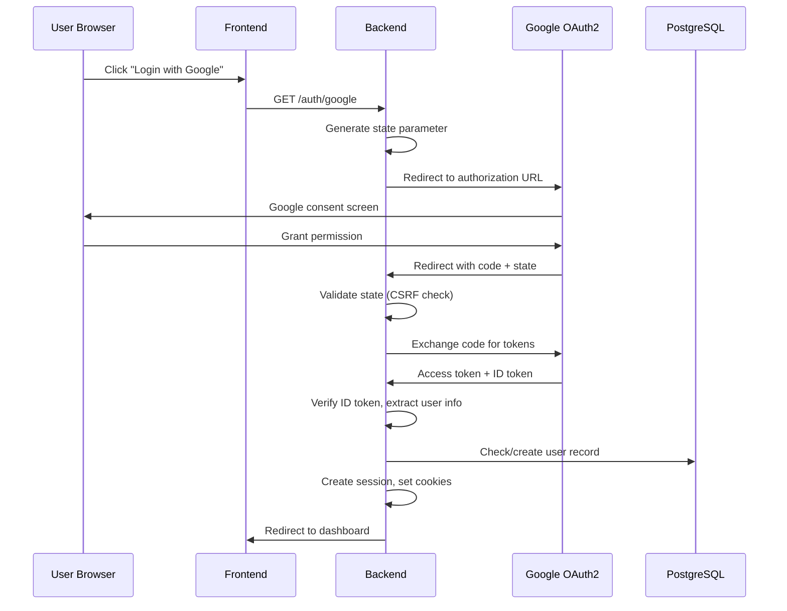
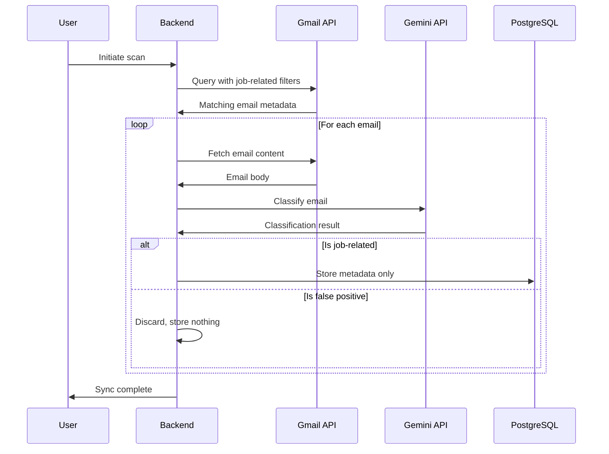
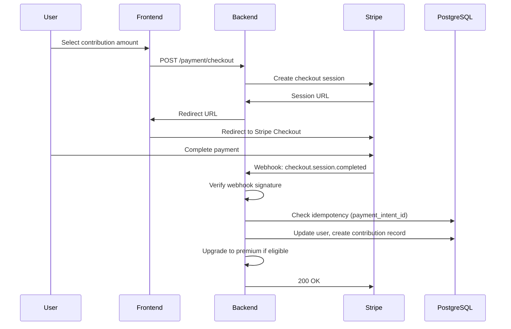
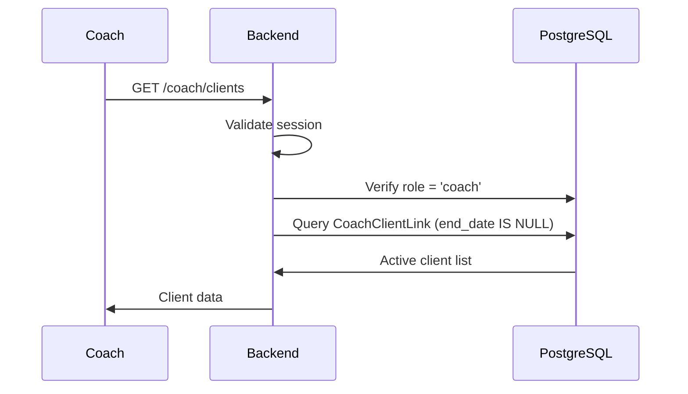
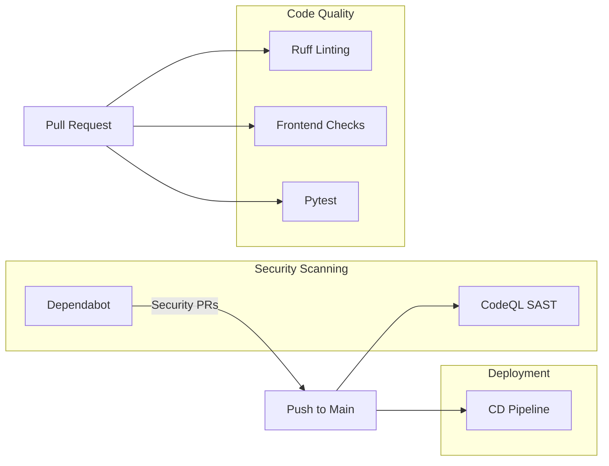

# Security Policy

This document provides a comprehensive overview of JustAJobApp's security architecture, including trust boundaries, system components, and data flows. JustAJobApp is responsible for undergoing a CASA Tier 2 Security Audit by a Google approved vendor. To report a vulnerability, email security@justajobapp.com.

## Table of Contents

- [Trust Boundary Overview](#trust-boundary-overview)
- [System Components](#system-components)
- [Data Flows](#data-flows)
- [External Service Integrations](#external-service-integrations)
- [Security Controls](#security-controls)
- [Data Handling Policies](#data-handling-policies)
- [CI/CD Security](#cicd-security)

---

## Trust Boundary Overview

### Trust Boundary Definitions

| Boundary | From | To | Trust Level | Validation |
|----------|------|-----|-------------|------------|
| TB-1 | User Browser | Frontend | Untrusted | Input sanitization, CSP |
| TB-2 | Frontend | Backend API | Semi-trusted | Session validation, rate limiting |
| TB-3 | Backend | PostgreSQL | Trusted | Internal network, credentials |
| TB-4 | Backend | Google OAuth2 | External-trusted | CSRF state validation |
| TB-5 | Backend | Gmail API | External-trusted | OAuth2 tokens, scoped access |
| TB-6 | Backend | Gemini API | External-trusted | API key, contractual terms |
| TB-7 | Backend | Stripe | External-trusted | Webhook signature verification |
| TB-8 | Frontend | PostHog | External-optional | First-party proxy |

---

## System Components

### Frontend (Next.js)

| Attribute | Value |
|-----------|-------|
| Technology | Next.js 16.1.5, React 18.3.1, TypeScript |
| Trust Level | Edge/DMZ - handles untrusted user input |
| Deployment | Standalone Docker container |

**Security Controls:**
- `X-Frame-Options: DENY` - Prevents clickjacking
- `Content-Security-Policy: frame-ancestors 'none'` - Additional clickjacking protection
- `X-Content-Type-Options: nosniff` - Prevents MIME-type sniffing
- `Referrer-Policy: strict-origin-when-cross-origin` - Controls referrer leakage
- `X-Powered-By` header disabled - Reduces technology fingerprinting
- Cache-Control: `no-cache, no-store` for HTML/API routes

**Configuration:** `frontend/next.config.js`

---

### Backend API (FastAPI)

| Attribute | Value |
|-----------|-------|
| Technology | FastAPI, Uvicorn, Python 3.11+ |
| Trust Level | Internal - session-validated requests only |
| Deployment | Docker container |

**Security Controls:**
- Session-based authentication via secure cookies
- CSRF protection via OAuth state parameter
- Rate limiting via SlowAPI on all endpoints
- Input validation via Pydantic models

**Key Files:**
- `backend/session/session_layer.py` - Session management
- `backend/routes/auth_routes.py` - Authentication flows
- `backend/utils/credential_service.py` - Credential encryption

---

### Database (PostgreSQL)

| Attribute | Value |
|-----------|-------|
| Technology | PostgreSQL 13 |
| Trust Level | Trusted - internal access only |
| Deployment | Docker container or managed service |

**Security Controls:**
- Connection via environment variable (no hardcoded credentials)
- Encrypted OAuth tokens (Fernet symmetric encryption)
- Schema migrations via Alembic

**Sensitive Tables:**
| Table | Sensitive Data | Protection |
|-------|---------------|------------|
| `oauth_credentials` | Refresh/access tokens | Fernet encryption |
| `users` | Email, Stripe IDs | Access control |
| `contributions` | Payment records | Access control |

---

### Background Scheduler (APScheduler)

| Attribute | Value |
|-----------|-------|
| Technology | APScheduler |
| Trust Level | Internal - runs within backend process |
| Schedule | Every 12 hours (3 AM / 3 PM UTC) |

**Purpose:** Automated email sync for premium users

**Security Controls:**
- Only processes premium-eligible users
- Uses encrypted credentials from database
- Automatic token refresh before expiry

---

## Data Flows

### Authentication Flow

**Security Justification:**
- State parameter prevents CSRF attacks during OAuth flow
- ID token verification ensures user identity
- Session ID stored in both cookie and server-side session for validation
- Secure cookies (`__Secure-` prefix) in production

---

### Email Processing Flow

**Data Minimization:**
- Gmail query uses narrow filter (known hiring platforms + keywords)
- Full email bodies are **never stored**
- Only extracted metadata persists: sender, company, job title, status, timestamp
- False positives: zero data retention

---

### Payment Flow

**Security Controls:**
- Webhook signature verification prevents spoofed events
- Idempotency check prevents duplicate processing
- User ID passed via metadata, not client-controlled

---

### Coach Data Access Flow

**Access Control:**
- Role-based access: only users with `role='coach'` can access
- Soft-delete pattern: `end_date` controls active relationships
- Coaches only see their own linked clients

---

## External Service Integrations

### Google OAuth2 / Identity

| Attribute | Value |
|-----------|-------|
| Purpose | User authentication |
| Scopes | `openid`, `email` (basic) or + `gmail.readonly` (full) |
| Trust Basis | Industry-standard OAuth2 provider |
| Risk Level | Medium |

**Justification:** Required for core functionality. Google is a trusted OAuth provider with robust security practices.

---

### Gmail API

| Attribute | Value |
|-----------|-------|
| Purpose | Read job-related emails |
| Scope | `gmail.readonly` |
| Access Pattern | Filtered queries only |
| Trust Basis | User-authorized, read-only access |
| Risk Level | Medium |

**Justification:** Core feature requirement. Scope is minimized to read-only. Queries are filtered to job-related domains/keywords before fetching.

---

### Google Gemini API

| Attribute | Value |
|-----------|-------|
| Purpose | Email classification |
| Data Sent | Email content for analysis |
| Trust Basis | Paid API with contractual data protection |
| Risk Level | Medium |

**Justification:** Enables automated classification without building custom ML. Paid tier contractually prohibits training on customer data.

---

### Stripe

| Attribute | Value |
|-----------|-------|
| Purpose | Payment processing |
| Data Sent | User ID (in metadata), payment amounts |
| Trust Basis | PCI-DSS compliant payment processor |
| Risk Level | High (payment data) |

**Justification:** Industry-standard payment processor. No card data handled by our servers. Webhook signature verification ensures event authenticity.

---

### PostHog

| Attribute | Value |
|-----------|-------|
| Purpose | Usage analytics |
| Data Sent | Page views, feature usage events |
| Trust Basis | Privacy-focused analytics platform |
| Risk Level | Low |

**Justification:** Helps improve product. Routed through first-party proxy to reduce tracking concerns. Optional for core functionality.

---

## Security Controls

### Authentication & Session Management

| Control | Implementation | Location |
|---------|---------------|----------|
| CSRF Protection | OAuth state parameter | `auth_routes.py:63-78` |
| Session Validation | Cookie + server-side match | `session_layer.py:41-90` |
| Secure Cookies | `__Secure-` prefix in production | `cookie_utils.py` |
| Token Refresh | Proactive refresh at 5-min threshold | `session_layer.py:120-133` |
| Inactive User Blocking | `is_active` flag check | `session_layer.py:77-87` |

### Rate Limiting

| Endpoint | Limit |
|----------|-------|
| `/auth/google` | 10/minute |
| `/processing/start` | 5/minute |
| `/stripe/webhook` | 100/minute |
| Most endpoints | 10-30/minute |

### Encryption

| Data | Method | Key Management |
|------|--------|----------------|
| OAuth tokens (DB) | Fernet symmetric | `TOKEN_ENCRYPTION_KEY` env var |
| Session data | Starlette session middleware | `SECRET_KEY` env var |

---

## Data Handling Policies

### What We Store

| Data Type | Stored | Purpose |
|-----------|--------|---------|
| User email address | Yes | Account identification |
| Email sender/subject | Yes | Dashboard display |
| Company name | Yes | Application tracking |
| Job title | Yes | Application tracking |
| Application status | Yes | Tracking progression |
| Timestamp | Yes | Timeline display |
| Full email body | **No** | Never persisted |
| Email attachments | **No** | Never accessed |
| Non-job emails | **No** | Filtered before fetch |

### Retention

- User data: Retained while account is active
- Deleted on account deletion request
- Logs: Rotated per standard practices

### Third-Party Data Sharing

| Service | Data Shared | Purpose |
|---------|-------------|---------|
| Google (Gemini) | Email content | Classification (not retained by Google per contract) |
| Stripe | User ID, payment amount | Payment processing |
| PostHog | Usage events | Analytics |

---

## CI/CD Security

### GitHub Workflows Overview

### Security Scanning (Active)

#### CodeQL Analysis (GitHub Code Scanning)

| Attribute | Value |
|-----------|-------|
| Status | **Active** |
| Trigger | Push to `main` |
| Languages | Python, JavaScript/TypeScript, GitHub Actions |

**Scans Performed:**
| Scan | Description |
|------|-------------|
| CodeQL / Analyze (python) | SAST for Python vulnerabilities |
| CodeQL / Analyze (javascript-typescript) | SAST for JS/TS vulnerabilities |
| CodeQL / Analyze (actions) | Security analysis of GitHub Actions workflows |

**Security Benefit:** Automatically detects security vulnerabilities including:
- SQL injection
- Cross-site scripting (XSS)
- Code injection
- Path traversal
- Insecure deserialization

---

#### Dependabot (`.github/dependabot.yml`)

| Attribute | Value |
|-----------|-------|
| Status | **Active** |
| Schedule | Weekly |
| Ecosystems | npm (frontend), pip (backend) |

**Configuration:**
- Security updates only (`open-pull-requests-limit: 0` for version updates)
- Monitors `/frontend` for npm vulnerabilities
- Monitors `/backend` for pip vulnerabilities

**Security Benefit:** Automatically creates PRs for known vulnerable dependencies.

---

### Code Quality Workflows

#### Python Linting (`.github/workflows/ruff.yml`)

| Attribute | Value |
|-----------|-------|
| Trigger | Push/PR affecting `*.py` files |
| Tool | Ruff (fast Python linter) |
| Purpose | Catch code quality issues and potential bugs |

**Security Benefit:** Catches common Python anti-patterns that could lead to vulnerabilities.

---

#### Frontend Checks (`.github/workflows/frontend-checks.yml`)

| Attribute | Value |
|-----------|-------|
| Trigger | PR to `main` affecting `frontend/**` |
| Checks | Build, Lint (ESLint), Format (Prettier) |

**Security Benefit:** ESLint rules catch potential XSS and other frontend security issues.

---

#### Python Tests (`.github/workflows/pytest.yml`)

| Attribute | Value |
|-----------|-------|
| Trigger | Push/PR affecting `*.py` or `*.yml` files |
| Framework | Pytest |
| Permissions | Minimal (read-only contents) |

**Security Controls:**
- Explicit minimal permissions defined
- Test environment uses dummy credentials
- No access to production secrets

---

### Deployment Pipeline (`.github/workflows/cd.yml`)

| Attribute | Value |
|-----------|-------|
| Trigger | Push to `main` |
| Target | AWS Lightsail |
| Environment | `prod` (requires approval) |

**Secret Management:**

| Secret Category | Secrets Used |
|-----------------|--------------|
| AWS Credentials | `AWS_ACCESS_KEY_ID`, `AWS_SECRET_ACCESS_KEY`, `AWS_REGION` |
| Google OAuth | `GOOGLE_CLIENT_ID`, `GOOGLE_CLIENT_SECRET`, `GOOGLE_CREDENTIALS_FILE_CONTENT` |
| Encryption | `TOKEN_ENCRYPTION_KEY`, `COOKIE_SECRET` |
| External Services | `STRIPE_SECRET_KEY`, `GOOGLE_API_KEY`, `IPINFO_TOKEN` |
| GitHub App | `GH_APP_ID`, `GH_PRIVATE_KEY`, `GH_INSTALLATION_ID` |
| Analytics | `NEXT_PUBLIC_POSTHOG_KEY` |

**Security Controls:**
- All secrets stored in GitHub Secrets (encrypted at rest)
- Deployment requires `prod` environment approval
- Minimal permissions (`contents: read` only)
- Secrets never logged or exposed in workflow output

---

### Workflow Permissions Summary

| Workflow | Permissions | Justification |
|----------|-------------|---------------|
| CodeQL | `security-events: write` | Upload scan results to GitHub Security tab |
| Dependabot | GitHub-managed | Automated security PRs |
| Ruff | Default (read) | Only needs to read Python files |
| Frontend | Default (read) | Only needs to read and build |
| Pytest | Explicit minimal | Security best practice |
| CD | `contents: read` | Minimal for deployment |

---

## Document History

| Version | Date | Author | Changes |
|---------|------|--------|---------|
| 1.0 | 2026-02-08 | Security Review | Initial documentation |
| 1.1 | 2026-02-08 | Security Review | Added CI/CD security workflows |
