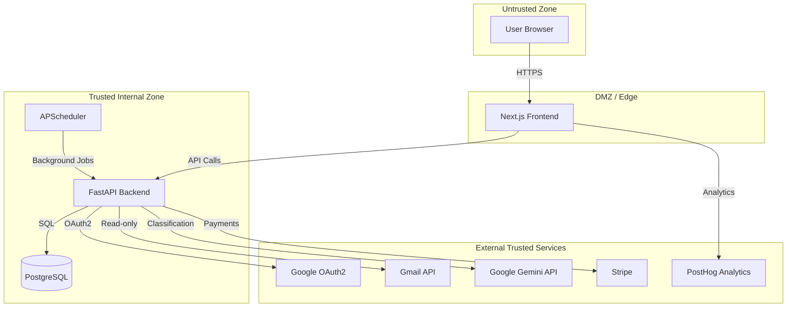
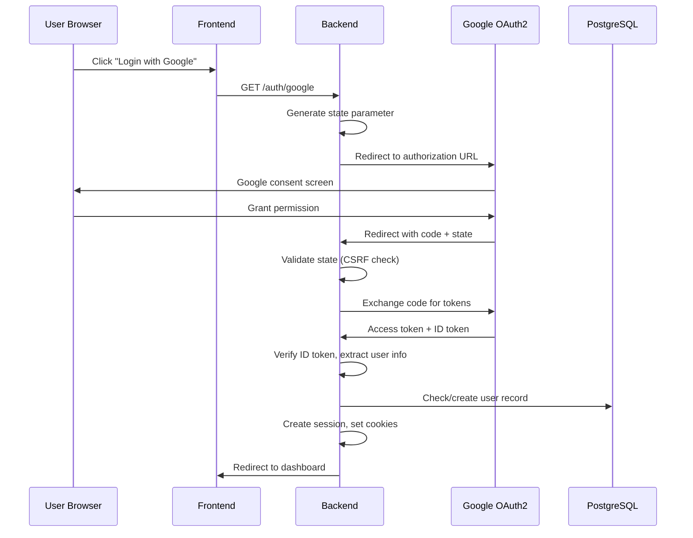
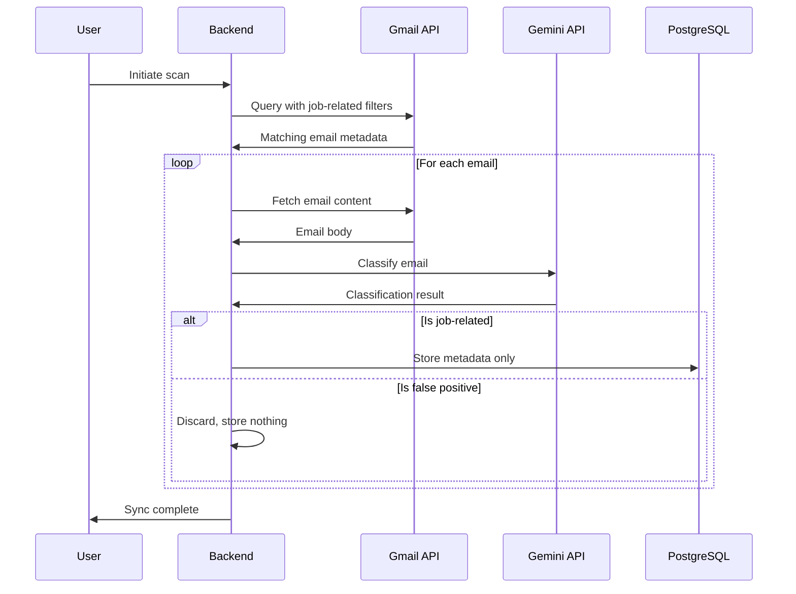
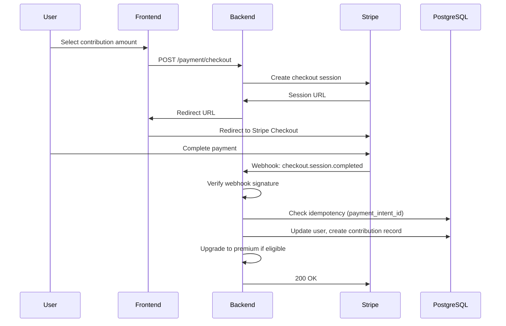
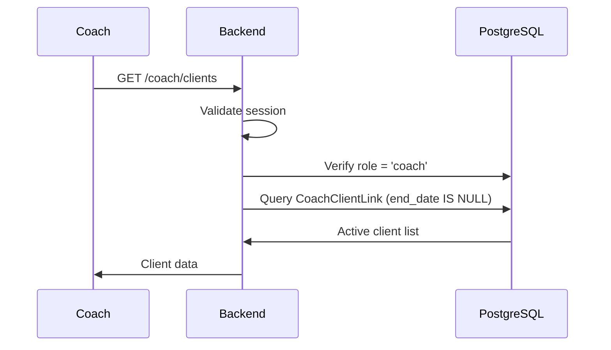
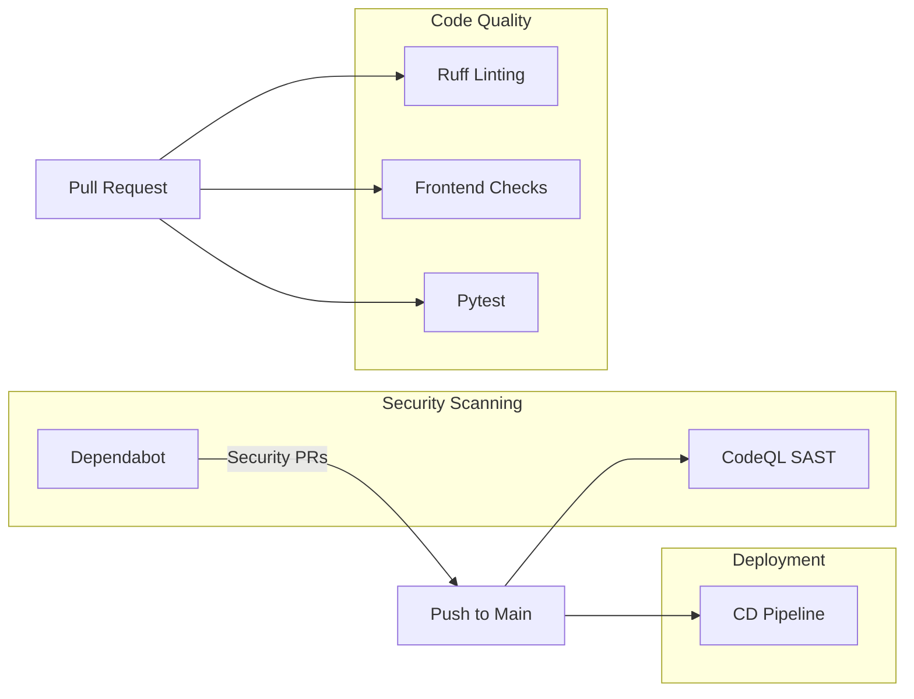

# Security Policy

This document provides a comprehensive overview of JustAJobApp's security architecture, including trust boundaries, system components, and data flows. JustAJobApp is responsible for undergoing a CASA Tier 2 Security Audit by a Google approved vendor. To report a vulnerability, email security@justajobapp.com.


## Table of Contents

- [Trust Boundary Overview](#trust-boundary-overview)
- [System Components](#system-components)
- [Data Flows](#data-flows)
- [External Service Integrations](#external-service-integrations)
- [Security Controls](#security-controls)
- [Data Classification](#data-classification)
  - [Classification Levels](#classification-levels)
  - [Protection Requirements Matrix](#protection-requirements-matrix)
  - [Detailed Protection Requirements](#detailed-protection-requirements)
- [Data Handling Policies](#data-handling-policies)
- [CI/CD Security](#cicd-security)

---

## Trust Boundary Overview



### Trust Boundary Definitions

| Boundary | From | To | Trust Level | Validation |
|----------|------|-----|-------------|------------|
| TB-1 | User Browser | Frontend | Untrusted | Input sanitization, CSP |
| TB-2 | Frontend | Backend API | Semi-trusted | Session validation, rate limiting |
| TB-3 | Backend | PostgreSQL | Trusted | Internal network, credentials |
| TB-4 | Backend | Google OAuth2 | External-trusted | CSRF state validation |
| TB-5 | Backend | Gmail API | External-trusted | OAuth2 tokens, scoped access |
| TB-6 | Backend | Gemini API | External-trusted | API key, contractual terms |
| TB-7 | Backend | Stripe | External-trusted | Webhook signature verification |
| TB-8 | Frontend | PostHog | External-optional | First-party proxy |

---

## System Components

### Frontend (Next.js)

| Attribute | Value |
|-----------|-------|
| Technology | Next.js 16.1.5, React 18.3.1, TypeScript |
| Trust Level | Edge/DMZ - handles untrusted user input |
| Deployment | Standalone Docker container |

**Security Controls:**
- `X-Frame-Options: DENY` - Prevents clickjacking
- `Content-Security-Policy: frame-ancestors 'none'` - Additional clickjacking protection
- `X-Content-Type-Options: nosniff` - Prevents MIME-type sniffing
- `Referrer-Policy: strict-origin-when-cross-origin` - Controls referrer leakage
- `X-Powered-By` header disabled - Reduces technology fingerprinting
- Cache-Control: `no-cache, no-store` for HTML/API routes

**Configuration:** `frontend/next.config.js`

---

### Backend API (FastAPI)

| Attribute | Value |
|-----------|-------|
| Technology | FastAPI, Uvicorn, Python 3.11+ |
| Trust Level | Internal - session-validated requests only |
| Deployment | Docker container |

**Security Controls:**
- Session-based authentication via secure cookies
- CSRF protection via OAuth state parameter
- Rate limiting via SlowAPI on all endpoints
- Input validation via Pydantic models

**Key Files:**
- `backend/session/session_layer.py` - Session management
- `backend/routes/auth_routes.py` - Authentication flows
- `backend/utils/credential_service.py` - Credential encryption

---

### Database (PostgreSQL)

| Attribute | Value |
|-----------|-------|
| Technology | PostgreSQL 13 |
| Trust Level | Trusted - internal access only |
| Deployment | Docker container or managed service |

**Security Controls:**
- Connection via environment variable (no hardcoded credentials)
- Encrypted OAuth tokens (Fernet symmetric encryption)
- Schema migrations via Alembic

**Sensitive Tables:**
| Table | Sensitive Data | Protection |
|-------|---------------|------------|
| `oauth_credentials` | Refresh/access tokens | Fernet encryption |
| `users` | Email, Stripe IDs | Access control |
| `contributions` | Payment records | Access control |

---

### Background Scheduler (APScheduler)

| Attribute | Value |
|-----------|-------|
| Technology | APScheduler |
| Trust Level | Internal - runs within backend process |
| Schedule | Every 12 hours (3 AM / 3 PM UTC) |

**Purpose:** Automated email sync for premium users

**Security Controls:**
- Only processes premium-eligible users
- Uses encrypted credentials from database
- Automatic token refresh before expiry

---

## Data Flows

### Authentication Flow



**Security Justification:**
- State parameter prevents CSRF attacks during OAuth flow
- ID token verification ensures user identity
- Session ID stored in both cookie and server-side session for validation
- Secure cookies (`__Secure-` prefix) in production

---

### Email Processing Flow



**Data Minimization:**
- Gmail query uses narrow filter (known hiring platforms + keywords)
- Full email bodies are **never stored**
- Only extracted metadata persists: sender, company, job title, status, timestamp
- False positives: zero data retention

---

### Payment Flow



**Security Controls:**
- Webhook signature verification prevents spoofed events
- Idempotency check prevents duplicate processing
- User ID passed via metadata, not client-controlled

---

### Coach Data Access Flow



**Access Control:**
- Role-based access: only users with `role='coach'` can access
- Soft-delete pattern: `end_date` controls active relationships
- Coaches only see their own linked clients

---

## External Service Integrations

### Google OAuth2 / Identity

| Attribute | Value |
|-----------|-------|
| Purpose | User authentication |
| Scopes | `openid`, `email` (basic) or + `gmail.readonly` (full) |
| Trust Basis | Industry-standard OAuth2 provider |
| Risk Level | Medium |

**Justification:** Required for core functionality. Google is a trusted OAuth provider with robust security practices.

---

### Gmail API

| Attribute | Value |
|-----------|-------|
| Purpose | Read job-related emails |
| Scope | `gmail.readonly` |
| Access Pattern | Filtered queries only |
| Trust Basis | User-authorized, read-only access |
| Risk Level | Medium |

**Justification:** Core feature requirement. Scope is minimized to read-only. Queries are filtered to job-related domains/keywords before fetching.

---

### Google Gemini API

| Attribute | Value |
|-----------|-------|
| Purpose | Email classification |
| Data Sent | Email content for analysis |
| Trust Basis | Paid API with contractual data protection |
| Risk Level | Medium |

**Justification:** Enables automated classification without building custom ML. Paid tier contractually prohibits training on customer data.

---

### Stripe

| Attribute | Value |
|-----------|-------|
| Purpose | Payment processing |
| Data Sent | User ID (in metadata), payment amounts |
| Trust Basis | PCI-DSS compliant payment processor |
| Risk Level | High (payment data) |

**Justification:** Industry-standard payment processor. No card data handled by our servers. Webhook signature verification ensures event authenticity.

---

### PostHog

| Attribute | Value |
|-----------|-------|
| Purpose | Usage analytics |
| Data Sent | Page views, feature usage events |
| Trust Basis | Privacy-focused analytics platform |
| Risk Level | Low |

**Justification:** Helps improve product. Routed through first-party proxy to reduce tracking concerns. Optional for core functionality.

---

## Security Controls

### Authentication & Session Management

| Control | Implementation | Location |
|---------|---------------|----------|
| CSRF Protection | OAuth state parameter | `auth_routes.py:63-78` |
| Session Validation | Cookie + server-side match | `session_layer.py:41-90` |
| Secure Cookies | `__Secure-` prefix in production | `cookie_utils.py` |
| Token Refresh | Proactive refresh at 5-min threshold | `session_layer.py:120-133` |
| Inactive User Blocking | `is_active` flag check | `session_layer.py:77-87` |

### Rate Limiting

| Endpoint | Limit |
|----------|-------|
| `/auth/google` | 10/minute |
| `/processing/start` | 5/minute |
| `/stripe/webhook` | 100/minute |
| Most endpoints | 10-30/minute |

### Encryption

| Data | Method | Key Management |
|------|--------|----------------|
| OAuth tokens (DB) | Fernet symmetric | `TOKEN_ENCRYPTION_KEY` env var |
| Session data | Starlette session middleware | `SECRET_KEY` env var |

---

## Data Classification

All sensitive data is classified into protection levels with corresponding security controls.

### Classification Levels

| Level | Description | Examples |
|-------|-------------|----------|
| **CRITICAL** | Encryption keys, API secrets | `TOKEN_ENCRYPTION_KEY`, `STRIPE_SECRET_KEY` |
| **HIGH** | OAuth tokens, credentials | Refresh tokens, access tokens |
| **MEDIUM** | PII (emails, payment IDs) | User email, Stripe customer ID |
| **LOW** | Application metadata | Company name, job title, application status |
| **PUBLIC** | Non-sensitive data | Application version, feature flags |

---

### Protection Requirements Matrix

Each classification level has specific requirements across five security dimensions:

| Level | Encryption at Rest | Encryption in Transit | Integrity | Retention | Access Control |
|-------|-------------------|----------------------|-----------|-----------|----------------|
| **CRITICAL** | N/A (not stored) | TLS (1.2 preferred) | Fail-fast validation | Rotate annually minimum | Infrastructure team only |
| **HIGH** | Required (Fernet AES-128) | TLS (1.2 preferred) | Decrypt validation | Until account deletion | User-scoped, system processes |
| **MEDIUM** | Not required | TLS (1.2 preferred) | Schema validation | Until account deletion | User-scoped, authorized coaches |
| **LOW** | Not required | TLS (1.2 preferred) | Schema validation | Until account deletion | User-scoped, authorized coaches |
| **PUBLIC** | Not required | TLS recommended | None | No restriction | No restriction |

> **Note:** AWS Lightsail container services support TLS 1.0, 1.1, and 1.2. TLS 1.2 is negotiated by default with modern browsers. TLS version cannot be restricted at the container service level without adding a Lightsail Distribution.

---

### Detailed Protection Requirements

#### Encryption Requirements

| Level | At Rest | In Transit | Key Management |
|-------|---------|------------|----------------|
| **CRITICAL** | Never stored in database | TLS (1.2 preferred) | Stored in environment variables or secrets manager |
| **HIGH** | Fernet symmetric encryption (AES-128-CBC + HMAC-SHA256) | TLS (1.2 preferred) | `TOKEN_ENCRYPTION_KEY` env var |
| **MEDIUM** | Database-level encryption (if available) | TLS (1.2 preferred) | Managed by database provider |
| **LOW** | None required | TLS (1.2 preferred) | N/A |
| **PUBLIC** | None required | TLS recommended | N/A |

#### Integrity Requirements

| Level | Validation Method | Tamper Detection | Implementation |
|-------|------------------|------------------|----------------|
| **CRITICAL** | Fail-fast on invalid/default values | N/A (not stored) | `config.py` validation on startup |
| **HIGH** | Decryption validation (Fernet includes HMAC) | HMAC-SHA256 via Fernet | `encryption_utils.py` |
| **MEDIUM** | Pydantic schema validation | Database constraints | API input/output validation |
| **LOW** | Pydantic schema validation | Database constraints | API input/output validation |
| **PUBLIC** | None required | None required | N/A |

#### Retention Requirements

| Level | Retention Period | Deletion Trigger | Deletion Method |
|-------|-----------------|------------------|-----------------|
| **CRITICAL** | Rotate minimum annually | Key rotation schedule | Replace in secrets manager |
| **HIGH** | Until account deletion or token revocation | User logout, account deletion, or OAuth revocation | Hard delete from `oauth_credentials` |
| **MEDIUM** | Until account deletion | User account deletion request | Cascade delete with user record |
| **LOW** | Until account deletion | User account deletion request | Cascade delete with user record |
| **PUBLIC** | No restriction | N/A | N/A |

**Log Retention:**
- Application logs: Container instance lifetime only (deleted on redeployment)
- No persistent log storage configured
- User activity analytics: PostHog (see PostHog retention policy)

#### Privacy & Confidentiality Requirements

| Level | Access Control | Audit Trail | Data Minimization |
|-------|---------------|-------------|-------------------|
| **CRITICAL** | Infrastructure team only, no application access | AWS Lightsail container instance log | Only store what's required for operation |
| **HIGH** | User-scoped, system processes only | PostHog activity events | Only store for premium users |
| **MEDIUM** | User-scoped + authorized coach access | PostHog activity events | Collect only necessary PII |
| **LOW** | User-scoped + authorized coach access | PostHog activity events | No restrictions |
| **PUBLIC** | No restriction | None | No restrictions |

---

### CRITICAL - Encryption Keys & Secrets

These values are **never stored in the database or logs**. Production deployment fails if not configured.

| Data | Storage | Protection | Config Location |
|------|---------|------------|-----------------|
| `TOKEN_ENCRYPTION_KEY` | Environment variable | Fernet key for OAuth token encryption | `config.py:19` |
| `COOKIE_SECRET` | Environment variable | Session cookie signing | `config.py:18` |
| `GOOGLE_CLIENT_SECRET` | Environment variable | OAuth2 client authentication | `config.py:14` |
| `STRIPE_SECRET_KEY` | Environment variable | Payment API authentication | `config.py:20` |
| `STRIPE_WEBHOOK_SECRET` | Environment variable | Webhook signature verification | `config.py:21` |
| `DATABASE_URL` | Environment variable | Database connection credentials | `config.py:29` |
| `GOOGLE_API_KEY` | Environment variable | Gemini API authentication | `config.py:16` |

**Controls:**
- Stored only in environment variables or GitHub Secrets
- Never committed to version control (`.env` in `.gitignore`)
- Production fails fast if `TOKEN_ENCRYPTION_KEY` is default value
- Rotatable without code changes

---

### HIGH - OAuth Tokens

OAuth tokens enable access to user email and are encrypted at rest.

| Data | Table | Column | Protection |
|------|-------|--------|------------|
| Refresh Token | `oauth_credentials` | `encrypted_refresh_token` | Fernet encryption |
| Access Token | `oauth_credentials` | `encrypted_access_token` | Fernet encryption |

**Controls:**
- Encrypted using Fernet symmetric encryption (`backend/utils/encryption_utils.py`)
- Only stored for premium users (data minimization)
- Decrypted only when actively needed for API calls
- Token expiry stored unencrypted (needed for refresh logic)

**Encryption Implementation:**
```
encrypt_token() → Fernet.encrypt() → Base64 ciphertext → Database
Database → Base64 ciphertext → Fernet.decrypt() → decrypt_token()
```

---

### MEDIUM - Personal Identifiable Information (PII)

PII requires authentication and authorization for access.

| Data | Table | Column | Purpose |
|------|-------|--------|---------|
| User Email | `users` | `user_email` | Account identification, login |
| Sync Email | `users` | `sync_email_address` | Email account being monitored |
| Stripe Customer ID | `users` | `stripe_customer_id` | Payment customer reference |
| Stripe Subscription ID | `users` | `stripe_subscription_id` | Subscription management |
| Payment Intent ID | `contributions` | `stripe_payment_intent_id` | Payment idempotency |
| Email Sender | `user_emails` | `email_from` | Application source tracking |

**Controls:**
- Server-side session validation required for all access
- User can only access their own data (enforced by `user_id` filtering)
- Coach access requires verified `CoachClientLink` relationship
- No client-side caching of PII

---

### LOW - Application Metadata

Non-sensitive application data with standard access controls.

| Data | Table | Column | Purpose |
|------|-------|--------|---------|
| Company Name | `user_emails` | `company_name` | Dashboard display |
| Job Title | `user_emails` | `job_title` | Dashboard display |
| Application Status | `user_emails` | `application_status` | Dashboard display |
| Email Subject | `user_emails` | `subject` | Dashboard display |
| Received Date | `user_emails` | `received_at` | Timeline display |
| User Role | `users` | `role` | Access control (jobseeker/coach) |
| Coach-Client Links | `coach_client_link` | `coach_id`, `client_id` | Relationship tracking |

**Controls:**
- Standard session-based access control
- Scoped to authenticated user or authorized coach

---

### NOT STORED - Explicitly Excluded Data

The following data is **never persisted** to minimize data exposure:

| Data Type | Reason | Handling |
|-----------|--------|----------|
| Full email body | Data minimization | Processed in memory, only metadata extracted |
| Email attachments | Not needed | Never fetched from Gmail API |
| Non-job emails | Privacy | Filtered by Gmail query before fetch |
| User passwords | OAuth only | Google handles authentication |
| Payment card data | PCI compliance | Handled entirely by Stripe |
| Email content after classification | Privacy | Discarded after LLM processing |

---

### Data Classification by Database Table

| Table | Classification | Encrypted Fields | Access Control |
|-------|---------------|------------------|----------------|
| `oauth_credentials` | HIGH | `encrypted_refresh_token`, `encrypted_access_token` | User-scoped |
| `users` | MEDIUM | None | User-scoped |
| `contributions` | MEDIUM | None | User-scoped |
| `user_emails` | LOW-MEDIUM | None | User-scoped + Coach |
| `coach_client_link` | LOW | None | Coach-scoped |
| `processing_tasks` | LOW | None | User-scoped |

---

## Data Handling Policies

### What We Store

| Data Type | Stored | Purpose |
|-----------|--------|---------|
| User email address | Yes | Account identification |
| Email sender/subject | Yes | Dashboard display |
| Company name | Yes | Application tracking |
| Job title | Yes | Application tracking |
| Application status | Yes | Tracking progression |
| Timestamp | Yes | Timeline display |
| Full email body | **No** | Never persisted |
| Email attachments | **No** | Never accessed |
| Non-job emails | **No** | Filtered before fetch |

### Retention

Retention periods are determined by data classification level (see [Protection Requirements Matrix](#protection-requirements-matrix)):

| Data Type | Classification | Retention Period | Deletion Method |
|-----------|---------------|------------------|-----------------|
| Encryption keys/secrets | CRITICAL | Rotate annually minimum | Replace in secrets manager |
| OAuth tokens | HIGH | Until logout/deletion/revocation | Hard delete |
| User PII | MEDIUM | Until account deletion | Cascade delete |
| Application metadata | LOW | Until account deletion | Cascade delete |
| Application logs | N/A | Container instance lifetime | Deleted on redeployment |
| User activity analytics | N/A | PostHog retention policy | Managed by PostHog |

**Deletion Process:**
- Account deletion removes all user data within 30 days
- OAuth tokens are immediately invalidated on logout
- Backup retention follows the same classification-based periods

### Third-Party Data Sharing

| Service | Data Shared | Purpose |
|---------|-------------|---------|
| Google (Gemini) | Email content | Classification (not retained by Google per contract) |
| Stripe | User ID, payment amount | Payment processing |
| PostHog | Usage events | Analytics |

---

## CI/CD Security

### GitHub Workflows Overview



### Security Scanning (Active)

#### CodeQL Analysis (GitHub Code Scanning)

| Attribute | Value |
|-----------|-------|
| Status | **Active** |
| Trigger | Push to `main` |
| Languages | Python, JavaScript/TypeScript, GitHub Actions |

**Scans Performed:**
| Scan | Description |
|------|-------------|
| CodeQL / Analyze (python) | SAST for Python vulnerabilities |
| CodeQL / Analyze (javascript-typescript) | SAST for JS/TS vulnerabilities |
| CodeQL / Analyze (actions) | Security analysis of GitHub Actions workflows |

**Security Benefit:** Automatically detects security vulnerabilities including:
- SQL injection
- Cross-site scripting (XSS)
- Code injection
- Path traversal
- Insecure deserialization

---

#### Dependabot (`.github/dependabot.yml`)

| Attribute | Value |
|-----------|-------|
| Status | **Active** |
| Schedule | Weekly |
| Ecosystems | npm (frontend), pip (backend) |

**Configuration:**
- Security updates only (`open-pull-requests-limit: 0` for version updates)
- Monitors `/frontend` for npm vulnerabilities
- Monitors `/backend` for pip vulnerabilities

**Security Benefit:** Automatically creates PRs for known vulnerable dependencies.

---

### Code Quality Workflows

#### Python Linting (`.github/workflows/ruff.yml`)

| Attribute | Value |
|-----------|-------|
| Trigger | Push/PR affecting `*.py` files |
| Tool | Ruff (fast Python linter) |
| Purpose | Catch code quality issues and potential bugs |

**Security Benefit:** Catches common Python anti-patterns that could lead to vulnerabilities.

---

#### Frontend Checks (`.github/workflows/frontend-checks.yml`)

| Attribute | Value |
|-----------|-------|
| Trigger | PR to `main` affecting `frontend/**` |
| Checks | Build, Lint (ESLint), Format (Prettier) |

**Security Benefit:** ESLint rules catch potential XSS and other frontend security issues.

---

#### Python Tests (`.github/workflows/pytest.yml`)

| Attribute | Value |
|-----------|-------|
| Trigger | Push/PR affecting `*.py` or `*.yml` files |
| Framework | Pytest |
| Permissions | Minimal (read-only contents) |

**Security Controls:**
- Explicit minimal permissions defined
- Test environment uses dummy credentials
- No access to production secrets

---

### Deployment Pipeline (`.github/workflows/cd.yml`)

| Attribute | Value |
|-----------|-------|
| Trigger | Push to `main` |
| Target | AWS Lightsail |
| Environment | `prod` (requires approval) |

**Secret Management:**

| Secret Category | Secrets Used |
|-----------------|--------------|
| AWS Credentials | `AWS_ACCESS_KEY_ID`, `AWS_SECRET_ACCESS_KEY`, `AWS_REGION` |
| Google OAuth | `GOOGLE_CLIENT_ID`, `GOOGLE_CLIENT_SECRET`, `GOOGLE_CREDENTIALS_FILE_CONTENT` |
| Encryption | `TOKEN_ENCRYPTION_KEY`, `COOKIE_SECRET` |
| External Services | `STRIPE_SECRET_KEY`, `GOOGLE_API_KEY`, `IPINFO_TOKEN` |
| GitHub App | `GH_APP_ID`, `GH_PRIVATE_KEY`, `GH_INSTALLATION_ID` |
| Analytics | `NEXT_PUBLIC_POSTHOG_KEY` |

**Security Controls:**
- All secrets stored in GitHub Secrets (encrypted at rest)
- Deployment requires `prod` environment approval
- Minimal permissions (`contents: read` only)
- Secrets never logged or exposed in workflow output

---

### Workflow Permissions Summary

| Workflow | Permissions | Justification |
|----------|-------------|---------------|
| CodeQL | `security-events: write` | Upload scan results to GitHub Security tab |
| Dependabot | GitHub-managed | Automated security PRs |
| Ruff | Default (read) | Only needs to read Python files |
| Frontend | Default (read) | Only needs to read and build |
| Pytest | Explicit minimal | Security best practice |
| CD | `contents: read` | Minimal for deployment |

---

## Document History

| Version | Date | Author | Changes |
|---------|------|--------|---------|
| 1.0 | 2026-02-08 | Security Review | Initial documentation |